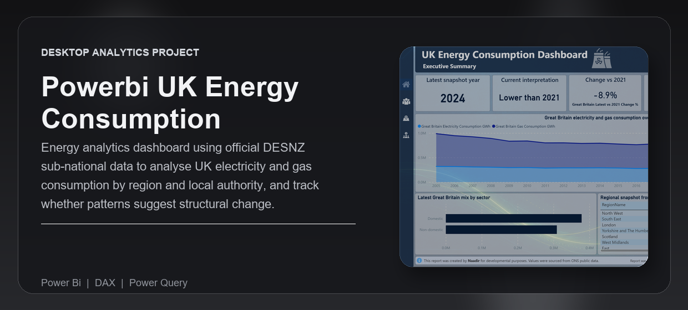
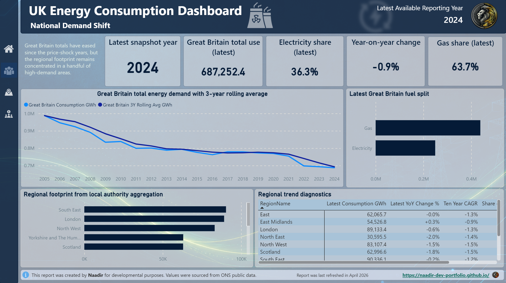
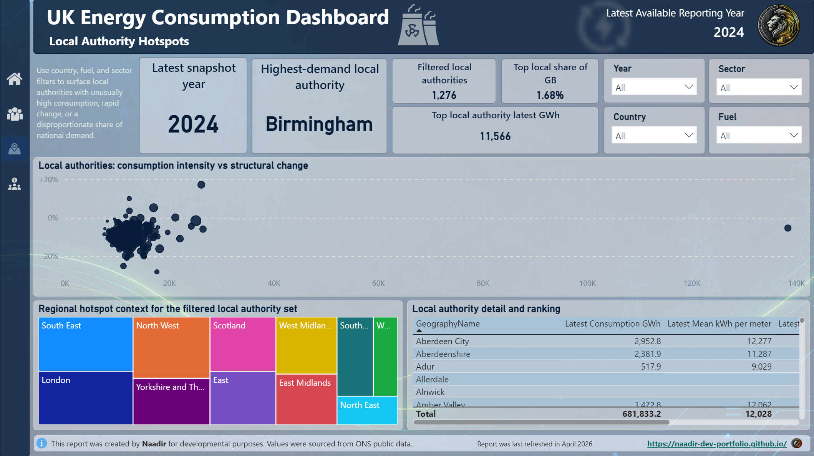
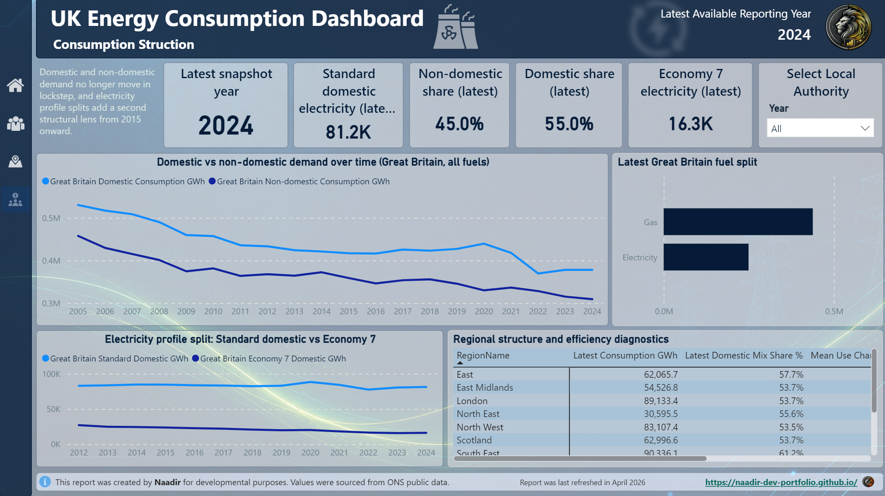

---
<div align="center">


<br /><br />

<p><strong>Public-sector energy dashboard tracking Great Britain electricity and gas consumption across regions and local authorities — showing where demand is highest, how usage is changing, and whether recent shifts look structural.</strong></p>

<p>Built for analysts, policy teams, and portfolio reviewers who need a clear view of sub-national UK energy demand using official public data.</p>

<p><strong>Technical documentation:</strong> <a href="https://naadir-dev-portfolio.github.io/powerbi-uk-energy-consumption-dashboard/">View the published report documentation</a></p>

<p>
  <a href="#overview">Overview</a> |
  <a href="#what-problem-it-solves">What It Solves</a> |
  <a href="#feature-highlights">Features</a> |
  <a href="#screenshots">Screenshots</a> |
  <a href="#quick-start">Quick Start</a> |
  <a href="#tech-stack">Tech Stack</a>
</p>

<h3><strong>Made by Naadir | May 2026</strong></h3>

</div>

---

## Overview

UK Energy Consumption is a Power BI dashboard built around official DESNZ sub-national electricity and gas consumption data. It tracks demand from 2005 to 2024 across Great Britain, regions, countries, and local authorities, with measures for total consumption, fuel split, sector mix, year-on-year change, change since 2021, and local demand intensity.

The report supports a practical analysis workflow: start with the executive summary, move into national demand trends, compare regional footprints, then drill into local authority hotspots and consumption structure. It is designed to answer whether energy use is rising, falling, or settling into a lower post-2021 pattern.

The outcome is a clean portfolio-ready Power BI project with scripted data sourcing, model-ready CSVs, a star-schema semantic model, DAX measures, and a finished four-page report focused on energy demand, efficiency signals, and geographic variation.

## What Problem It Solves

- Removes the need to manually combine separate DESNZ electricity and gas CSVs across local authority and regional levels
- Replaces spreadsheet-based trend checks with a reusable Power BI model and scripted refresh process
- Makes it easier to see where demand is concentrated, which places are unusual, and how recent use compares with 2021
- Gives a stronger analytical view than raw public tables by combining national, regional, local, fuel, and sector measures in one report

### At a glance

| Track | Analyse | Compare |
|---|---|---|
| Electricity and gas consumption from 2005 to 2024 | Demand direction, fuel mix, sector split, and local intensity | Great Britain, regions, countries, and local authorities |
| Latest reporting year, fuel, sector, and local authority filters | YoY change, change vs 2021, mean kWh per meter, and 3-year rolling average | Electricity vs gas and domestic vs non-domestic demand |
| Power BI report pages and model-ready CSV outputs | KPI cards, line charts, bar charts, scatter plots, treemaps, and diagnostic tables | Regional footprint, local hotspots, and structural demand patterns |

## Feature Highlights

- **Executive summary**, headline cards show latest reporting year, Great Britain demand, YoY movement, change vs 2021, and the current structural signal
- **National demand trends**, long-run line charts compare total demand with a 3-year rolling average to separate short-term movement from broader direction
- **Fuel and sector mix**, bar and area visuals compare electricity, gas, domestic, and non-domestic consumption patterns
- **Regional comparison**, regional roll-ups show where demand is concentrated and how areas differ on trend, share, and efficiency metrics
- **Local authority hotspot analysis**, scatter and treemap views identify high-demand places and unusual local consumption profiles
- **Scripted public-data pipeline**, Python scripts download official DESNZ CSVs and rebuild the model-ready data layer without API keys

### Core capabilities

| Area | What it gives you |
|---|---|
| **National snapshot** | A fast read on latest Great Britain consumption, direction of change, and whether demand is above or below the 2021 baseline |
| **Trend analysis** | Long-run electricity and gas movement across 2005-2024, including rolling-average smoothing |
| **Local authority explorer** | A focused view of local demand hotspots, local share of Great Britain use, and mean consumption per meter |
| **Consumption structure** | Domestic vs non-domestic demand, electricity profile split, fuel share, and regional structure diagnostics |

## Screenshots

<details>
<summary><strong>Open screenshot gallery</strong></summary>

<br />

<div align="center">
  
  <br /><br />
  
  <br /><br />
  
</div>

</details>

## Quick Start

```bash
# Clone the repo
git clone https://github.com/Naadir-Dev-Portfolio/powerbi-uk-energy-consumption-dashboard.git
cd powerbi-uk-energy-consumption-dashboard

# Install dependencies
python -m pip install pandas

# Run
python "Source Data\download_uk_energy_data.py"
python "Source Data\build_uk_energy_model.py"
```

Open `UK Energy Consumption Dashboard.pbip` in Power BI Desktop, refresh the model, and mark `Dim Date` as the date table using `YearStartDate`. No API keys are required because the data is sourced from public GOV.UK CSV files.

## Tech Stack

<details>
<summary><strong>Open tech stack</strong></summary>

<br />

| Category | Tools |
|---|---|
| **Primary stack** | DAX | Power Query |
| **UI / App layer** | Power BI Desktop | PBIP | PBIR |
| **Data / Storage** | CSV | TMDL | GOV.UK public data files |
| **Automation / Integration** | Python ingestion scripts | DESNZ public CSV downloads | model-ready transformation pipeline |
| **Platform** | Windows | Power BI Desktop |

</details>

## Architecture & Data

<details>
<summary><strong>Open architecture and data details</strong></summary>

<br />

### Application model

The project starts with official DESNZ stacked electricity and gas CSVs for local authorities and regions. Python scripts download the raw files into `Source Data/raw`, transform them into a model-ready star schema in `Source Data/processed`, and preserve source metadata for repeatable refreshes.

Power BI imports the processed CSV layer through Power Query. The semantic model uses date, geography, fuel, sector, and electricity-profile dimensions connected to energy consumption fact tables. DAX measures calculate total demand, latest-year snapshots, YoY change, change since 2021, fuel share, sector mix, mean kWh per meter, rolling averages, ranking, and local authority hotspot labels.

The report outputs four analytical pages: Executive Summary, National Demand Shift, Local Authority Hotspots, and Consumption Structure. Together they show national direction, regional differences, local outliers, and whether recent demand patterns suggest structural change or short-term pressure.

### Project structure

```text
powerbi-uk-energy-consumption-dashboard/
+-- UK Energy Consumption Dashboard.pbip
+-- UK Energy Consumption Dashboard.Report/
+-- UK Energy Consumption Dashboard.SemanticModel/
+-- Source Data/
+-- .build/
+-- BUILD_GUIDE.md
+-- project_map.html
+-- README.md
+-- repo-card.png
+-- portfolio/
    +-- powerbi-uk-energy-consumption.json
    +-- powerbi-uk-energy-consumption.webp
    +-- Screen1.png
    +-- Screen2.png
    +-- Screen3.png
```

### Data / system notes

- Data is sourced from official Department for Energy Security and Net Zero stacked electricity and gas consumption CSVs on GOV.UK
- Coverage runs from 2005 to 2024, with regional and local authority analysis where the public datasets support it
- The model keeps `Sector = All` source rows for published mean and median metrics while DAX measures avoid double-counting in additive totals
- Gas data follows DESNZ methodology notes, including weather-corrected consumption and exclusions for unique sites in the time series
- Electricity profile analysis is available from 2015 onward for Standard domestic and Economy 7 domestic meters
- The project is local-first and does not require API keys, accounts, or private data access

</details>

## Contact

Questions, feedback, or collaboration: naadir.dev.mail@gmail.com

<sub>DAX | Power Query</sub>

---
